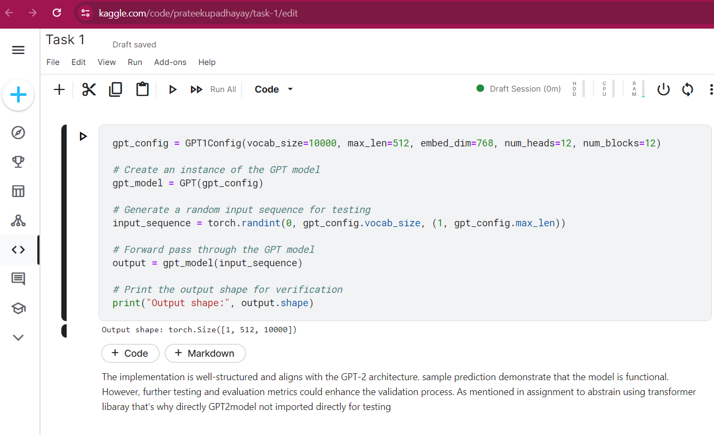

<h1 align="center">
    Contlo Coding Assignment By Prateek Upadhayay
</h1>  

- All three coding assignment tasks are attached as Python files with their respective names in the 'contlo_assignment' repository.   
- Additionally, a document 'Summary of all Task' outlining the methodology has been included for better understanding.   
- You can find an online link to a Kaggle notebook in readme file containing all three tasks for enhanced presentation. Please take a look at each file and the accompanying documentation.  
---
### [Task_1 on kaggle](https://www.kaggle.com/code/prateekupadhayay/task-1)

### [Task_2 on kaggle](https://www.kaggle.com/code/prateekupadhayay/task-2)
### [Task_3 on kaggle](https://www.kaggle.com/code/prateekupadhayay/task-3)
---
## Output

---

## Refrences-
- DDP: https://pytorch.org/tutorials/intermediate/ddp_tutorial.html  
- FSDP: https://pytorch.org/tutorials/intermediate/FSDP_tutorial.html  
- Referred to the GPT-2 paper and Andrej Karpathy’s nanogpt  
- RoFormer paper by Su et al.  
- GQA paper by Ainslie et al.
- Longformer paper by Beltagy et al.

